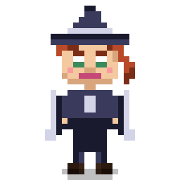

# ◆ Sprite Forge ◆

A 16-bit JRPG character sprite generator. Single-file HTML artifact — no build step, no dependencies, just open it in a browser.



## What it does

Generates cute pixel art characters on a 32×32 canvas with full parameter control:

- **11 sliders**: skin tone, hair color, hair style, eye color, outfit, outfit color, accessory, headwear, expression, class, build
- **8 hair styles** (short, long, spiky, ponytail, pixie, braids, mohawk, bald)
- **5 outfits** (tunic, robe, armor, jacket, dress)
- **5 hats** (none, hood, headband, wizard, crown)
- **4 accessories** (none, scarf, cape, glasses, earrings)
- **3 expressions** (neutral, smile, wink)
- **Lock buttons** on every slider — preserve what you like, re-roll the rest
- **Shareable seed codes** — every combination encodes to a short code like `03-05-06-02-01-08-02-02-00-00-0A` that round-trips exactly
- **PNG export** at 256×256, works on iOS (long-press to save to Photos) and desktop (direct download)

## Running it

```
open sprite-forge.html
```

Or just double-click the file. That's it. It's a single self-contained HTML file — all CSS, JS, and sprite logic are inline. Google Fonts (VT323, Press Start 2P, JetBrains Mono) are loaded from a CDN.

## How the sprites work

The sprite is drawn pixel-by-pixel onto a 32×32 canvas at native resolution, then scaled up with `image-rendering: pixelated` for crisp edges. Body parts are drawn in layers:

1. Ground shadow
2. Legs + boots
3. Outfit (procedural per style, uses state.outfit to pick rendering path)
4. Head + neck + face shading
5. Eyes (wink branch if expression === 2)
6. Eyebrows, nose, mouth
7. Cheek blush
8. Hair (stored as pixel-pattern arrays in `HAIR_PIXELS`)
9. Accessory
10. Hat (drawn last, on top of hair)

Hair styles and outfits are deterministic — same state, same pixels. Colors come from palette arrays (`SKIN`, `HAIR`, `OUTFIT`) and are looked up by slider index.

## Seed format

`NN-NN-NN-NN-NN-NN-NN-NN-NN-NN-NN` — 11 base-36 pairs joined by dashes, one per control (skin, hairColor, hairStyle, eye, outfit, outfitColor, acc, hat, expr, cls, bld). The PNG export filename is always the seed, so the filename *is* the shareable code.

## Known quirks

- Some combos look better than others at 32×32. Mohawk + hood is visually cursed. Wizard hat + long hair is great.
- The idle bounce is 4px at 1.4s — subtle, steps(2) for proper pixel-art snap.
- Save PNG on iOS opens an overlay with the image — long-press to save to Photos. This is because iOS Safari intentionally ignores the HTML `download` attribute, so the workaround is to show the raw image and let the native OS gesture handle saving.

## Built with

Claude, over four rounds of mobile Safari debugging. Final version works on iOS, Android, and desktop browsers. No frameworks.

## License

MIT — do whatever you want with it.
